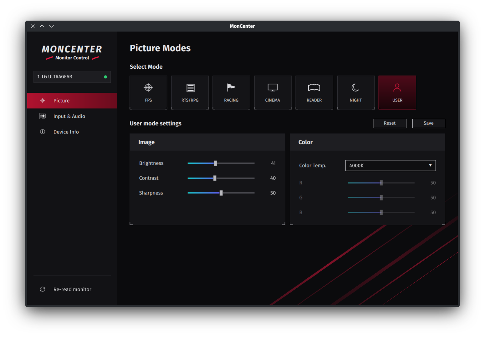

# MonCenter

Gaming-style control panel for external monitors on Linux. It talks DDC/CI through [ddcutil](https://www.ddcutil.com/), so you can change brightness, contrast, sharpness, color temperature, R/G/B gain, input source and speaker volume without the monitor's joystick.



- **Picture modes**: FPS, RTS/RPG, Racing, Cinema, Reader, Night, User. These are presets kept in the app, and you can save your own values into any of them.
- **Input & Audio**: switch inputs, change volume, mute. After an input switch, MonCenter switches back after 10 seconds unless you press **Keep**, so an input with no picture can't leave you with a blank screen.
- **Device Info**: serial, firmware, refresh rate, usage hours.

- **Tray and shortcuts** (KDE Plasma): MonCenter keeps running in the system tray after you close the window. **Meta+Alt+1…7** switch modes from anywhere and show Plasma's on-screen popup. You can rebind them in System Settings → Keyboard → Shortcuts → MonCenter. The tray menu has the modes and a **Start at login** toggle.

There's also a small KDE Plasma 6 panel widget in `package/` with the same controls.

## Install

```bash
./install.sh              # deps, DDC/CI access, app, launcher; reports what your monitor supports
./install.sh --widget     # also the Plasma panel widget
./install.sh --uninstall
```

It supports pacman, apt, dnf and zypper, loads `i2c-dev`, and sets up `/dev/i2c-*` access if ddcutil can't see your monitor (you may need to log out and in once). Manual requirements: `ddcutil` and `pyside6`.

MonCenter reads the monitor's DDC/CI capabilities at startup and shows only the controls, color temperatures and inputs it supports. Picture mode presets snap to the nearest supported color temperature.

Run it with `moncenter`, or `./app/moncenter.py` from a checkout.

## Test

```bash
tests/run.sh   # parsers, QML load (offscreen) and installer checks; no monitor needed
```

## Notes

- Only the first display ddcutil detects is controlled.
- Codes are standard MCCS ones (tested on an LG UltraGear GS85Q and an AOC 24G2W1G4). Vendor-only picture modes are not exposed.
- The input auto-revert needs the monitor to keep answering DDC/CI on the original cable after switching. If yours doesn't, switch back with the monitor's own buttons.
- Launching MonCenter again while it runs in the tray opens the existing window.

## Disclaimer

MonCenter writes settings to your monitor's hardware over DDC/CI. Use it at your own risk. It comes with no warranty of any kind, and the authors aren't responsible for any damage, lost settings or other problems that come from using it. Monitors implement DDC/CI differently, so a value that works on one model can behave unexpectedly on another.

## License

[MIT](LICENSE)
